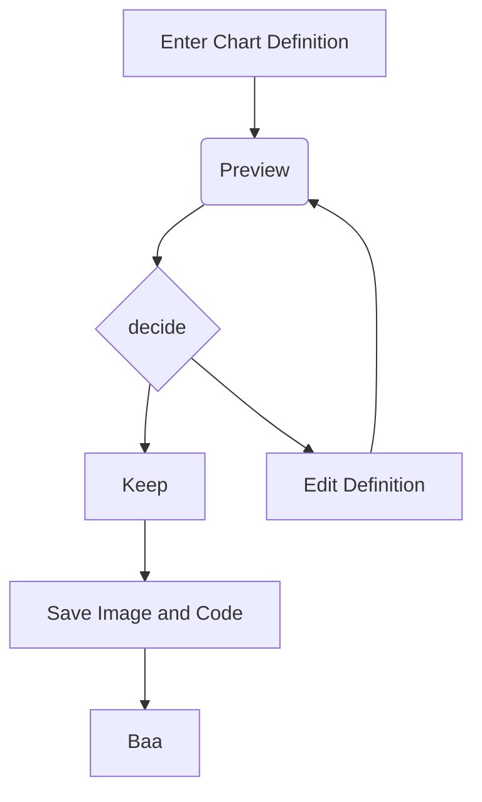

# Modest {{ test }}

- [ ] Incomplete task
- [x] Completed task

| Name   | Age |
|--------|-----|
| Alice  |  24 |
| Bob    |  30 |

[Modest](https://github.com/markdowncss/modest) is the fourth of many stylesheets to make HTML generated from
markdown look beautiful. A list of all available stylesheets can be found [here](https://github.com/markdowncss).

#### A markdown theme that is rather modest.



```bash
#!/bin/sh

set -eu

TUN_NAME=${1:?"parameter not set 'TUN_NAME'"}
TUN_PORT=${2:-41641}

TAILSCALE_SERVICE=tailscale
TAILSCALE_PREFIX="/opt/$TAILSCALE_SERVICE"
TAILSCALE_BIN_PREFIX="$TAILSCALE_PREFIX/bin"
TAILSCALE_TUN_PREFIX="$TAILSCALE_PREFIX/tun"
TAILSCALE_BIN="$TAILSCALE_BIN_PREFIX/tailscale"
TAILSCALED_BIN="$TAILSCALE_BIN_PREFIX/tailscaled"
TAILSCALE_STATE_DIRECTORY="$TAILSCALE_TUN_PREFIX/$TUN_NAME"
TAILSCALE_CLIENT="$TAILSCALE_SERVICE-$TUN_NAME"

systemd_unit() {
cat <<EOF
[Unit]
Description=Tailscale node agent %i
Documentation=https://tailscale.com/kb/
Wants=network-pre.target
After=network-pre.target NetworkManager.service systemd-resolved.service

[Service]
EnvironmentFile=$2/%i/tailscaled.defaults
Environment=STATE_DIRECTORY=$2/%i
ExecStart=$1 -no-logs-no-support -port \${PORT} -socket $2/%i/tailscaled.sock -statedir $2/%i -tun %i
ExecStopPost=$1 -cleanup -socket $2/%i/tailscaled.sock -statedir $2/%i -tun %i

Restart=on-failure
Type=notify

[Install]
WantedBy=multi-user.target
EOF
}

if [ ! -e "$TAILSCALE_BIN" ] || [ ! -e "$TAILSCALED_BIN" ]; then
    MACHINE="$(uname -m)"

    case "$MACHINE" in
        x86_64)
            ARCH="amd64"
            ;;

        *)
            printf 'unsupported machine %s\n' "$MACHINE" >&2
            exit 1
            ;;
    esac

    TAILSCALE_WEBPAGE="$(curl -fsSL https://pkgs.tailscale.com/stable)"
    TAILSCALE_VERSION="$(printf '%s' "$TAILSCALE_WEBPAGE" | sed -n 's|.*tailscale_\(.*\)_'"$ARCH"'.tgz.*|\1|p' | head -1)"
    TAILSCALE_DOWNLOAD="$(printf '%s' "$TAILSCALE_WEBPAGE" | sed -n 's|.*\(tailscale_'"$TAILSCALE_VERSION"'_'"$ARCH"'.tgz\).*|https://pkgs.tailscale.com/stable/\1|p' | head -1)"

    mkdir -p "$TAILSCALE_BIN_PREFIX" "$TAILSCALE_TUN_PREFIX"

    curl -fsSL "$TAILSCALE_DOWNLOAD" \
    | tar xzC "$TAILSCALE_BIN_PREFIX" --strip-components 1 "tailscale_${TAILSCALE_VERSION}_$ARCH/tailscaled" "tailscale_${TAILSCALE_VERSION}_$ARCH/tailscale"

    systemd_unit "$TAILSCALED_BIN" "$TAILSCALE_TUN_PREFIX" >"/etc/systemd/system/$TAILSCALE_SERVICE@.service"
    systemctl daemon-reload
fi

if [ -e "$TAILSCALE_STATE_DIRECTORY" ]; then
    exit 0
fi

mkdir -p "$TAILSCALE_STATE_DIRECTORY"

tee "$TAILSCALE_STATE_DIRECTORY/tailscaled.defaults" >/dev/null <<EOF
PORT="$TUN_PORT"
EOF

tee "$TAILSCALE_STATE_DIRECTORY/tailscale.sh" >/dev/null <<'EOF'
#!/bin/sh

MY_DIR="$(dirname "$(readlink -f "$0")")"

exec "$MY_DIR/../../bin/tailscale" --socket "$MY_DIR/tailscaled.sock" "$@"
EOF

chmod a+x "$TAILSCALE_STATE_DIRECTORY/tailscale.sh"

ln -sfn "$TAILSCALE_STATE_DIRECTORY/tailscale.sh" "/usr/local/bin/$TAILSCALE_CLIENT"

systemctl enable "$TAILSCALE_SERVICE@$TUN_NAME"
systemctl start "$TAILSCALE_SERVICE@$TUN_NAME"
```

```markdown
# Test

## Test2
```